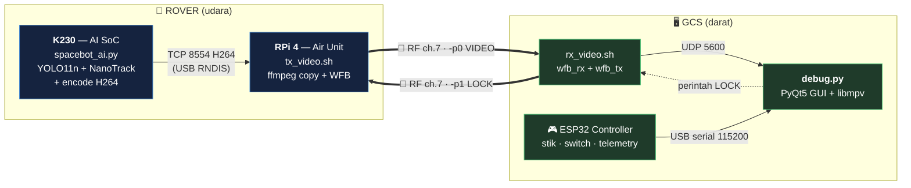
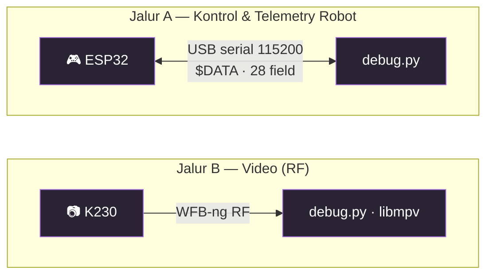
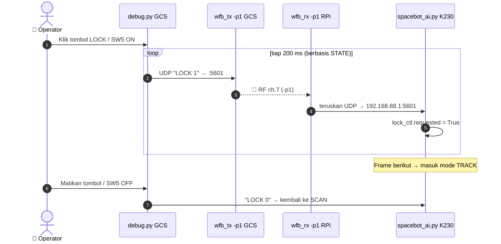
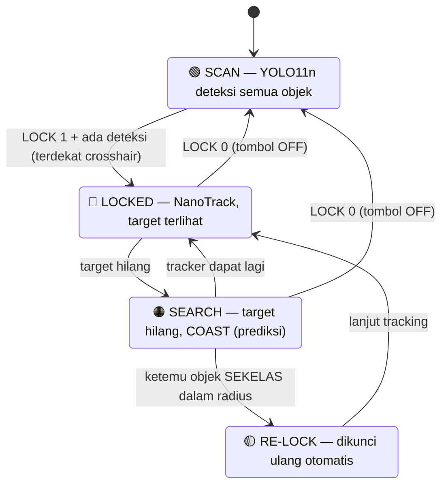
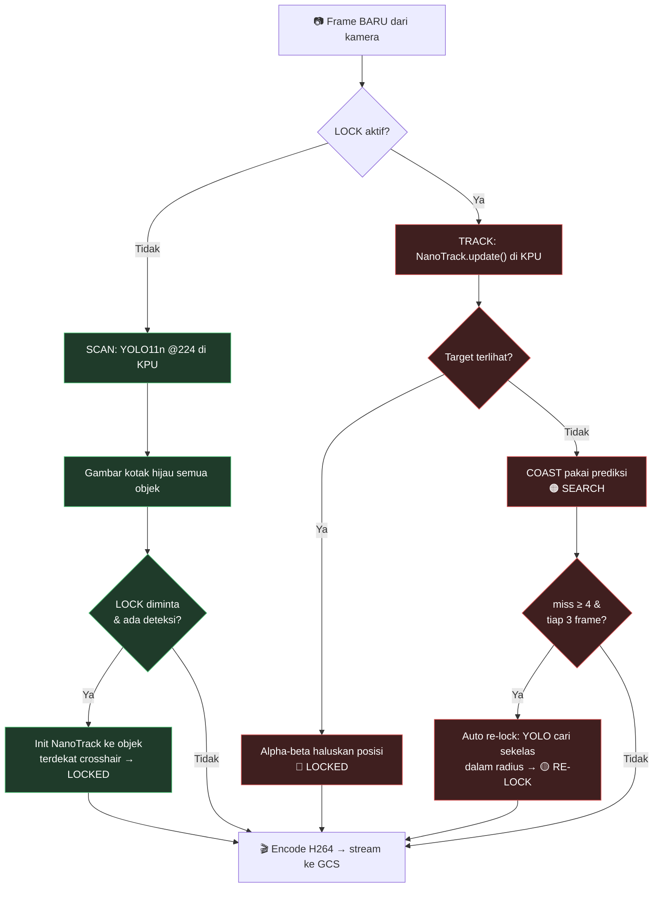
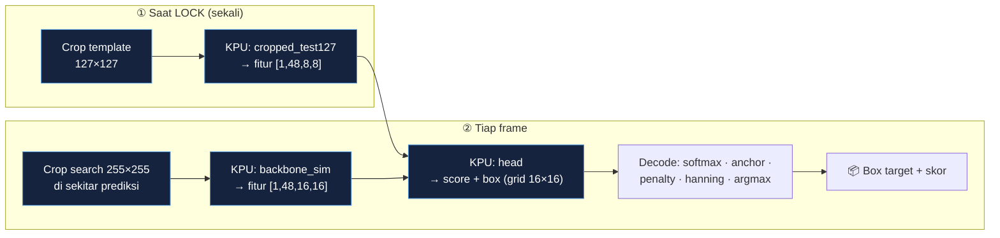
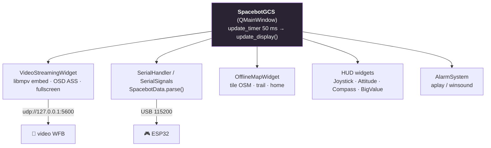
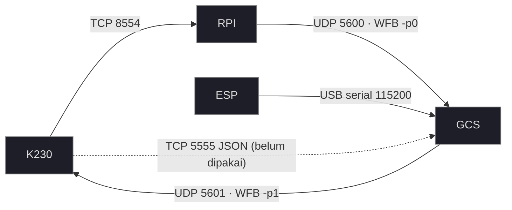

# 🛰️ SPACEBOT — Panduan Visual

Penjelasan sistem SPACEBOT dalam **diagram**. Semua diagram di bawah otomatis
ter-render saat dibuka di **GitHub** (Mermaid). Untuk penjelasan teks lengkap, lihat
[`DOKUMENTASI_SISTEM.md`](DOKUMENTASI_SISTEM.md).

---

## 1. 🗺️ Peta Besar — Tiga Mesin

Rover (di udara) ⟷ GCS (di darat). Video turun lewat RF, perintah LOCK naik lewat RF,
kontrol & telemetry robot lewat kabel serial.

---

## 2. 🎥 Pipeline Video (per langkah)

Kotak deteksi & HUD **digambar di K230**, lalu ikut ter-encode. RPi cuma menyalin
(tanpa encode ulang) → tambahan latency nyaris nol.

```mermaid
flowchart LR
    CAM["📷 Kamera<br/>640×480"] --> AI["K230: gambar kotak<br/>YOLO/NanoTrack + HUD"]
    AI --> ENC["ffmpeg h264_v4l2m2m<br/>300k CBR · -g10 · -bf0"]
    ENC -->|"TCP 8554"| COPY["RPi: ffmpeg -c:v copy<br/>→ MPEG-TS"]
    COPY -->|"UDP 5600"| WTX["wfb_tx -p0"]
    WTX ==>|"📡 RF ch.7"| WRX["wfb_rx -p0"]
    WRX -->|"UDP 127.0.0.1:5600"| MPV["debug.py: libmpv<br/>GPU + vsync"]
    MPV --> SCR["🖥️ Layar operator"]

    classDef k230 fill:#15233f,stroke:#4a90d9,color:#fff
    classDef rpi fill:#3f2f15,stroke:#d9a04a,color:#fff
    classDef gcs fill:#1f3b2a,stroke:#52c77a,color:#fff
    class CAM,AI,ENC k230
    class COPY,WTX rpi
    class WRX,MPV,SCR gcs
```

> 💡 **Kenapa mulus?** libmpv pakai GPU + vsync (semulus ffplay). **Kenapa low-latency?**
> `nobuffer`, `low_delay`, `tcp_nodelay`, `flush_packets`, GOP pendek, dan tak ada re-encode di RPi.

---

## 3. 🔀 Dua Jalur Data yang Terpisah Total

Keduanya **tidak dikorelasikan di software** — datang lewat jalan berbeda.
Telemetry AI K230 (JSON di TCP 5555) **belum** dipakai (rencana masa depan).

---

## 4. 🎯 Alur Perintah LOCK (GCS → Rover)

Tombol GCS **atau** switch SW5 → dikirim **berulang sebagai STATE** tiap 200 ms
(tahan paket hilang di RF).

---

## 5. 🧠 Mode Otak Rover: SCAN ↔ LOCK

Saat terkunci, **YOLO11 full-frame dimatikan** (hemat & stabil). Tidak otomatis
balik ke YOLO walau target hilang — **tetap LOCK sampai tombol dimatikan**.

---

## 6. ⚙️ Loop Utama K230 (tiap frame)

---

## 7. 🔬 Cara Kerja NanoTrack (full-KPU)

Tracker Siamese: bandingkan **template** (foto target saat dikunci) dengan area
**pencarian** tiap frame. **3 kmodel semua di KPU** — CPU hanya jadi "lem" ringan.

> ⏱️ **~7 ms/frame** (sekitar 140 fps headroom). KPU ≈ inti berat; CPU cuma crop/resize
> ringan + decode numpy. (Sub-window dioptimasi: 32 ms → 1.4 ms.)

---

## 8. 🎨 Legenda HUD Taktis (warna status)

Digambar di K230 (`draw_tactical`) dan menyatu di video:

| Warna | Status | Arti |
|:---:|---|---|
| 🔴 Merah | `LOCKED` | Target terkunci & terlihat |
| 🟡 Kuning | `RE-LOCK` | Baru dikunci ulang otomatis |
| 🟠 Oranye | `SEARCH` | Target hilang, sedang COAST + cari ulang |
| 🟢 Hijau | (SCAN) | Kotak deteksi YOLO biasa + panah arah gerak (lead) |

Elemen: corner-bracket reticle · center reticle · garis crosshair→target ·
panah lead (arah gerak) · bar confidence · teks `status conf dx dy`.

---

## 9. 🧩 Struktur `debug.py` (GCS)

---

## 10. 🔌 Port & Channel (sekilas)

| Apa | Port | Channel | Catatan |
|---|---|---|---|
| Video H264 K230→RPi | TCP 8554 | — | `tcp_nodelay=1` |
| Video RPi→GCS | UDP 5600 | WFB -p0 | hanya 1 proses bind 5600 |
| Perintah LOCK | UDP 5601 | WFB -p1 | "LOCK 1"/"LOCK 0" |
| Telemetry AI JSON | TCP 5555 | — | belum dipakai |
| Telemetry+kontrol robot | serial 115200 | — | `$DATA` 28 field |
| RF | — | **7** | tx & rx **wajib simetris** |

---

*Diagram = Mermaid (render otomatis di GitHub). Penjelasan teks: [`DOKUMENTASI_SISTEM.md`](DOKUMENTASI_SISTEM.md) · Hardware/WFB: [`SPACEBOT_WFBng_Session_Summary.md`](SPACEBOT_WFBng_Session_Summary.md).*
